# Azure Databricks Real-Time Streaming
### Live Fleet Operations Dashboard — End-to-End Streaming Pipeline

> **Business problem:** Operations finds out about delivery delays from customer complaints — not from data.
> **Solution:** Sub-60-second anomaly detection on live GPS telemetry. Ops sees every vehicle. Speed breach or engine anomaly triggers an alert before the customer calls.

---

## Architecture

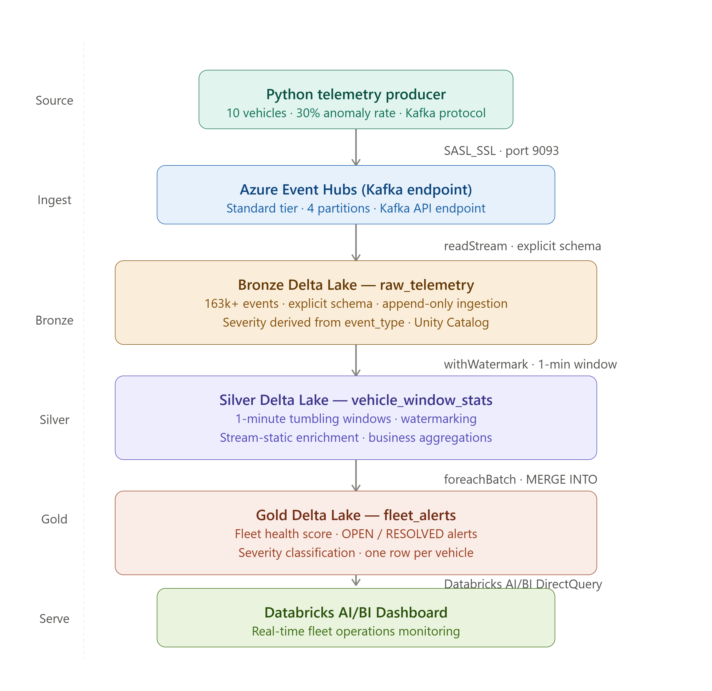

```
Python Telemetry Producer
10 vehicles · 30% anomaly rate · Kafka protocol
        ↓
Azure Event Hubs (Kafka Endpoint)
Standard tier · 4 partitions · SASL_SSL
        ↓
Bronze Delta Lake — raw_telemetry
163K+ events · explicit schema · append-only · Unity Catalog
        ↓
Silver Delta Lake — vehicle_window_stats
1-minute tumbling windows · watermarking · stream-static join
        ↓
Gold Delta Lake — fleet_alerts
One row per vehicle · OPEN/RESOLVED · severity classification
        ↓
Databricks AI/BI Dashboard
Real-time fleet operations monitoring
```

---

## Dashboard

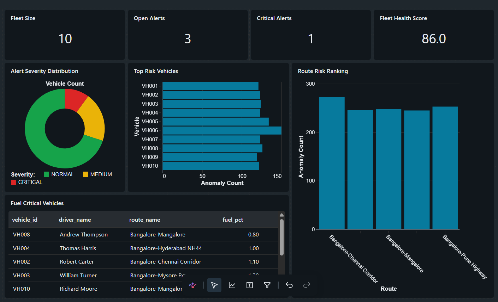

**Fleet Operations Mission Control** — 4 KPI cards, severity donut, route risk ranking, top risk vehicles, fuel critical table.

---

## Tech Stack

| Layer | Technology |
|-------|-----------|
| Ingestion | Azure Event Hubs (Kafka API) |
| Stream Processing | Databricks Structured Streaming (PySpark) |
| Storage | ADLS Gen2 — Bronze, Silver, Gold containers |
| Table Format | Delta Lake (ACID, time travel, Unity Catalog) |
| Governance | Unity Catalog (3-level namespace) |
| Dashboard | Databricks AI/BI (DirectQuery) |

---

## Business Impact

| Before | After |
|--------|-------|
| 30-minute batch lag | Sub-60-second alert latency |
| Reactive — customer complains first | Proactive — ops intervenes first |
| No live location visibility | Live fleet map, per-vehicle status |
| SLA breach discovered post-delivery | SLA breach predicted mid-route |

---

## Pipeline Screenshots

### Azure Infrastructure
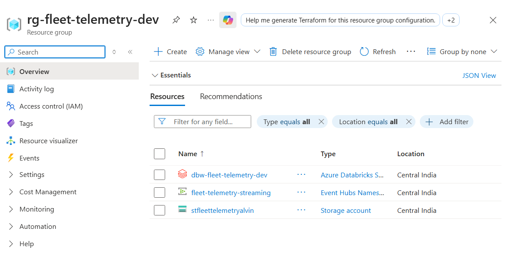

### Event Hubs — Live Data Flow
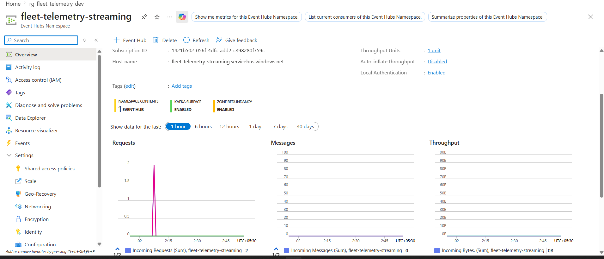

### Event Hub Instance
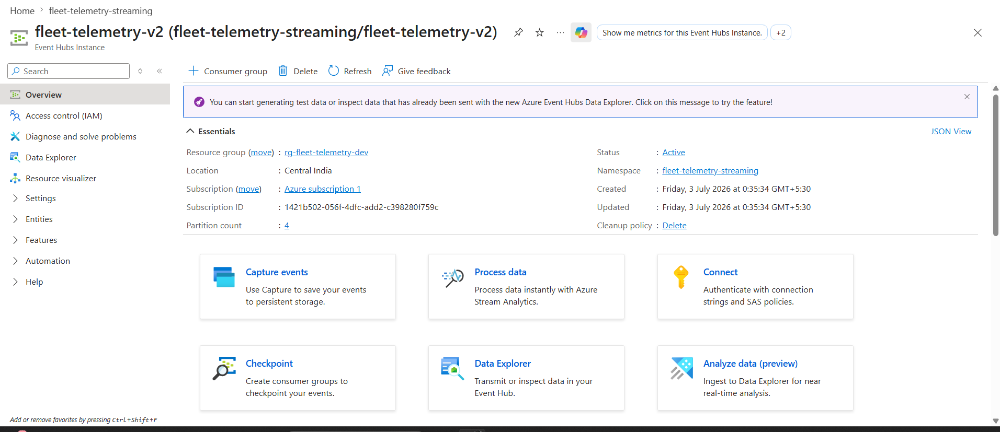

### ADLS Gen2 — Medallion Architecture Containers
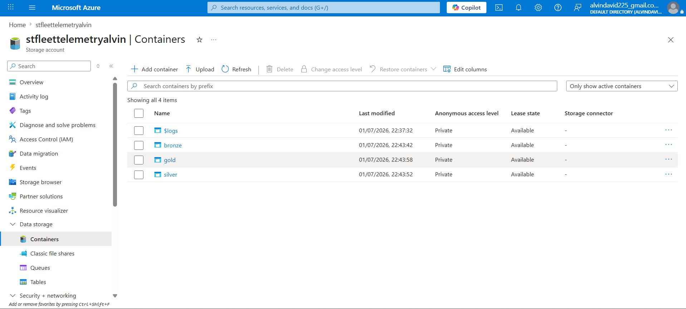

### Unity Catalog — Medallion Schemas
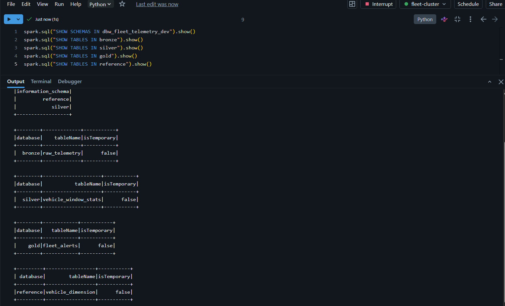

### Bronze Layer — 163K Events with Severity Distribution
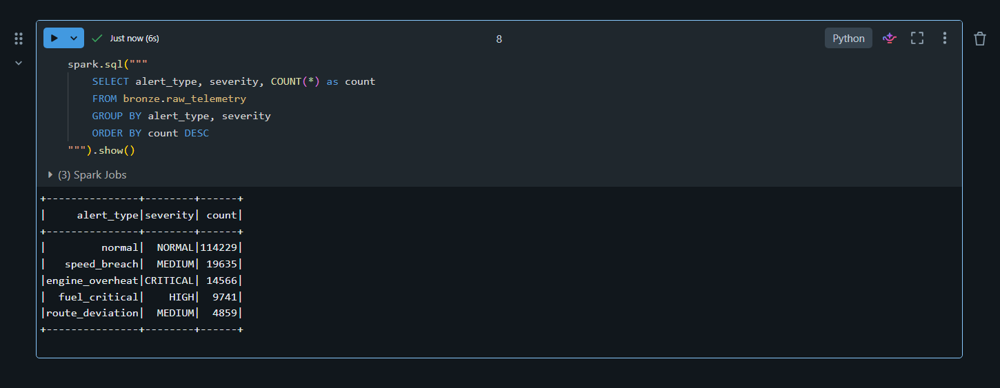

### Silver Layer — Windowed Aggregations
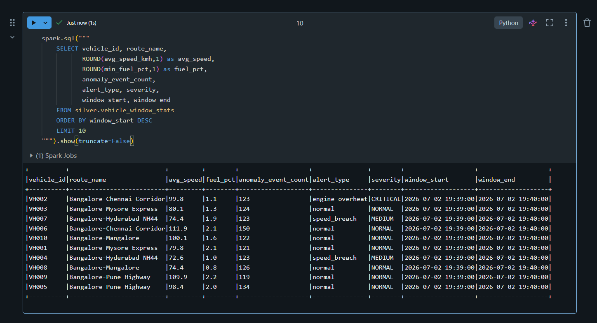

### Gold Layer — Live Alert State
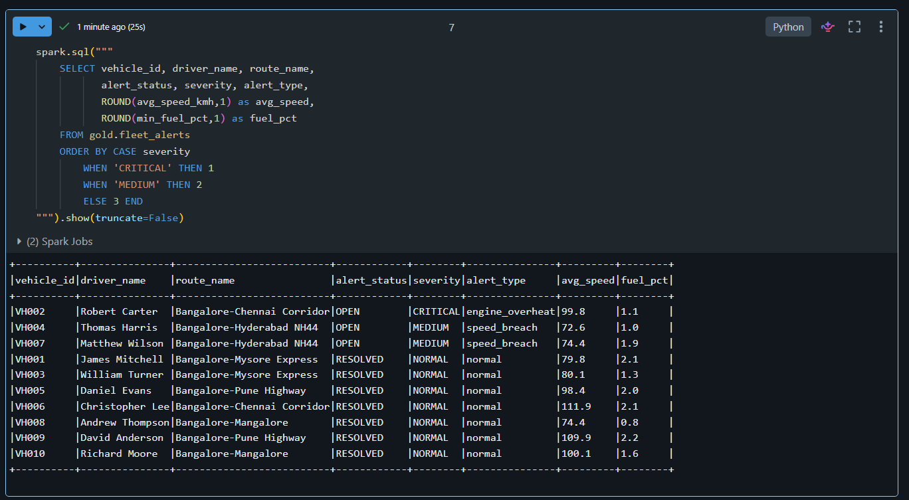

### Producer — 163K Events, Zero Errors
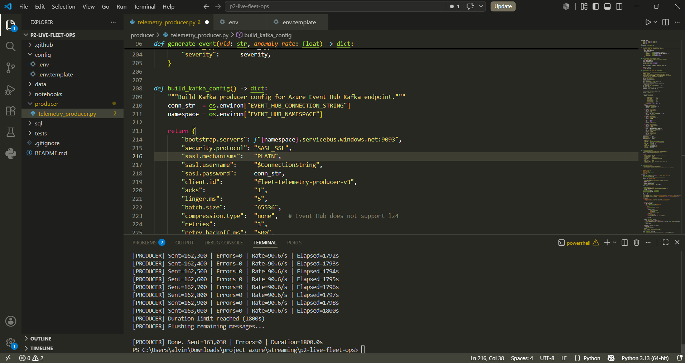

### 3 Streams Running Simultaneously
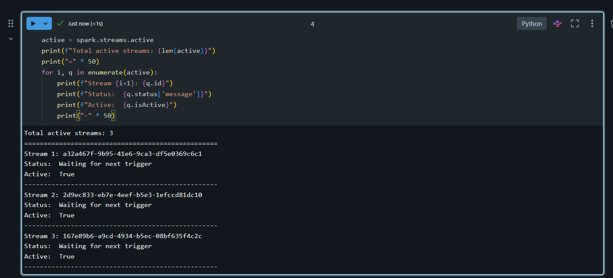

---

## Repository Structure

```
azure-databricks-real-time-streaming/
├── producer/
│   └── telemetry_producer.py       # Python Kafka producer — 10 vehicles, anomaly injection
├── notebooks/
│   ├── 00_setup.ipynb              # Cluster test, ADLS connection, reference table
│   ├── 01_bronze_ingestion.ipynb   # Event Hubs → Bronze Delta Lake (checkpointed stream)
│   ├── 02_silver_windowed_agg.ipynb # Watermark + tumbling window + stream-static join
│   └── 03_gold_alerts.ipynb        # foreachBatch → MERGE INTO Gold alerts table
├── sql/
│   └── ddl_all_tables.sql          # DDL for all Delta tables
├── data/reference/
│   └── vehicle_reference.csv       # 10 vehicles, routes, max speeds
├── config/
│   └── .env.template               # Environment variable template
├── screenshots/                    # Project evidence screenshots
└── README.md
```

---

## Data Model

### Bronze — `raw_telemetry`
Raw events from Event Hubs. Append-only. 163K+ rows.

| Column | Type | Notes |
|--------|------|-------|
| vehicle_id | STRING | Partition key |
| event_time | TIMESTAMP | Parsed from producer ISO timestamp |
| alert_type | STRING | Derived from event_type (engine_overheat, speed_breach, etc.) |
| severity | STRING | CRITICAL / HIGH / MEDIUM / LOW / NORMAL |
| speed_kmh | FLOAT | Current speed |
| fuel_pct | FLOAT | Fuel level 0-100 |
| engine_temp_c | FLOAT | Engine temperature °C |
| kafka_partition | INT | For gap detection |
| kafka_offset | BIGINT | For checkpoint recovery audit |

### Silver — `vehicle_window_stats`
1-minute tumbling window aggregates, enriched with vehicle dimension.

| Column | Notes |
|--------|-------|
| window_start / window_end | 1-minute tumbling window boundaries |
| avg_speed_kmh, max_speed_kmh | Speed stats for window |
| anomaly_event_count | Count of non-normal events |
| driver_name, route_name, rated_max_speed | From stream-static join |
| speed_pct_of_max | avg_speed / rated_max * 100 |

### Gold — `fleet_alerts`
One row per vehicle. MERGE INTO upsert on each micro-batch.

| Column | Notes |
|--------|-------|
| alert_type | engine_overheat / speed_breach / fuel_critical / route_deviation |
| severity | CRITICAL / HIGH / MEDIUM / LOW / NORMAL |
| alert_status | OPEN / RESOLVED |
| alert_raised_at | When alert first opened |
| last_updated_at | Last micro-batch update time |

---

## Alert Rules

| Rule | Severity |
|------|----------|
| engine_temp_c > 110°C | CRITICAL |
| speed > rated_max × 1.15 | MEDIUM |
| fuel_pct < 15% | HIGH |
| route_deviation detected | MEDIUM |
| gps_signal_loss | LOW |

---

## Setup

### Prerequisites
- Azure subscription (Event Hubs Standard, ADLS Gen2, Databricks)
- Databricks workspace (DBR 13.3 LTS, Unity Catalog enabled)
- Python 3.10+

### 1. Configure environment
```bash
cp config/.env.template config/.env
# Fill in your Event Hubs connection string and ADLS storage key
```

### 2. Start the producer
```bash
pip install confluent-kafka python-dotenv
python producer/telemetry_producer.py --rate 10 --vehicles 10 --anomaly 0.30 --duration 1800
```

### 3. Run notebooks in order
```
00_setup.ipynb              → Cluster test, schemas, reference table
01_bronze_ingestion.ipynb   → Start Bronze stream
02_silver_windowed_agg.ipynb → Start Silver stream
03_gold_alerts.ipynb         → Start Gold stream
```

### 4. Verify pipeline
```python
# Check all 3 streams running
for q in spark.streams.active:
    print(f"Stream: {q.id} | Status: {q.status['message']}")

# Check Bronze
spark.sql("SELECT alert_type, severity, COUNT(*) FROM bronze.raw_telemetry GROUP BY 1,2").show()

# Check Gold
spark.sql("SELECT vehicle_id, driver_name, severity, alert_type FROM gold.fleet_alerts").show()
```

---

## Key Interview Topics Covered

| Topic | Implementation |
|-------|---------------|
| Explicit schema vs inferSchema | Bronze notebook — StructType with severity derivation |
| Watermark mechanics | Silver — withWatermark("event_time", "1 minute") |
| Tumbling vs sliding window | Silver — F.window("event_time", "1 minute") |
| Stream-static join | Silver — F.broadcast(vehicle_ref) |
| append vs update vs complete | Silver uses append — windows emit once after watermark |
| foreachBatch + MERGE INTO | Gold — DeltaTable.merge() per micro-batch |
| Checkpoint recovery | Offsets/commits stored in ADLS _checkpoints/ |
| Unity Catalog | 3-level namespace: catalog.schema.table |
| Exactly-once semantics | Event Hubs at-least-once + Delta idempotent writes |

---

## Resume Line

> Built a real-time fleet telemetry monitoring platform using Python, Azure Event Hubs (Kafka endpoint), Databricks Structured Streaming, Delta Lake Medallion Architecture, and Databricks AI/BI Dashboard — processing 163K+ streaming events with live anomaly detection and sub-60-second operational alerting.

---

*Stack: Python · Apache Kafka · Azure Event Hubs · Azure ADLS Gen2 · Databricks · PySpark · Delta Lake · Unity Catalog · Databricks AI/BI*
